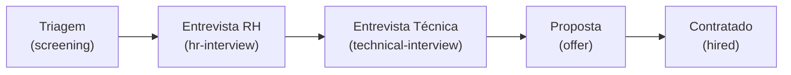
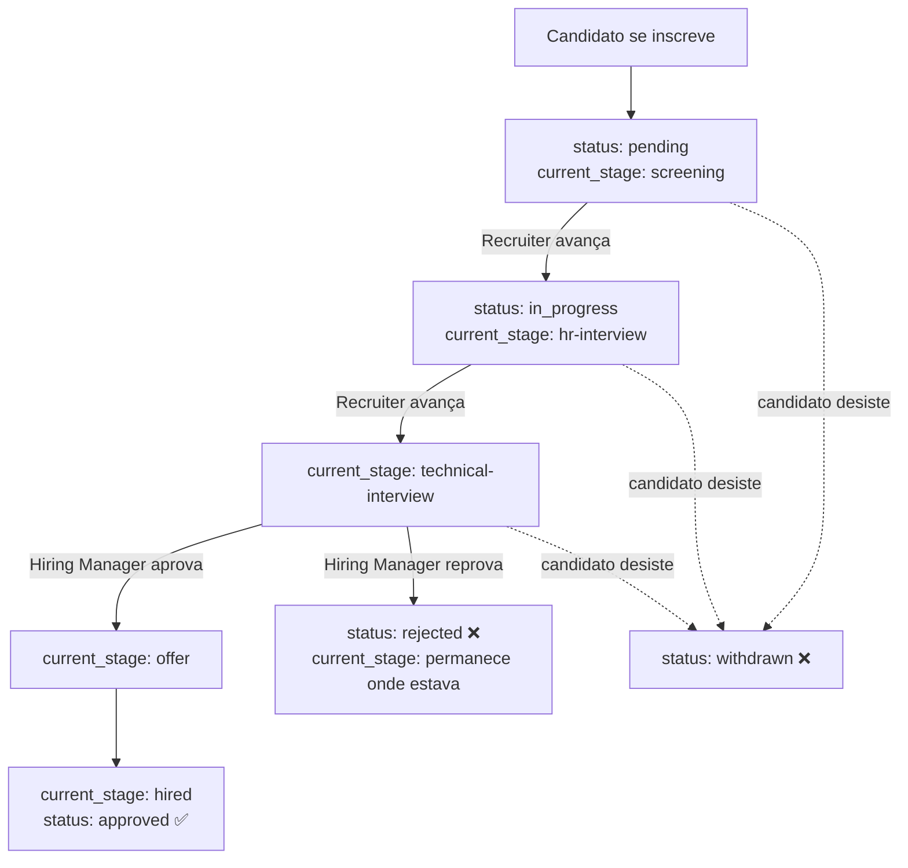
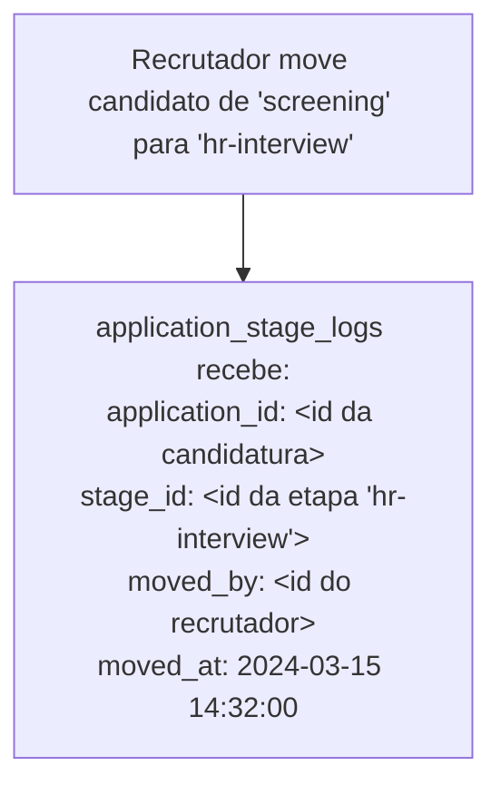

# 06 — Pipeline de Vagas

## Visão geral

O pipeline é o coração do HireFlow. Ele representa o caminho que um candidato percorre desde o momento em que se inscreve em uma vaga até ser contratado ou ter sua candidatura encerrada.

Cada vaga possui seu próprio pipeline, composto por etapas ordenadas. A movimentação de um candidato entre etapas é registrada de forma imutável, garantindo rastreabilidade completa do processo seletivo.

---

## Etapas padrão

Toda vaga criada no HireFlow recebe automaticamente cinco etapas padrão, nessa ordem:

| Order | Slug | Nome | Responsável típico | Descrição |
|---|---|---|---|---|
| 1 | `screening` | Triagem | Recruiter | Análise inicial do currículo e perfil do candidato |
| 2 | `hr-interview` | Entrevista RH | Recruiter | Entrevista comportamental e alinhamento cultural |
| 3 | `technical-interview` | Entrevista Técnica | Hiring Manager | Avaliação das competências técnicas exigidas pela vaga |
| 4 | `offer` | Proposta | Recruiter | Apresentação e negociação da proposta salarial |
| 5 | `hired` | Contratado | Recruiter | Candidato aceito — processo encerrado com sucesso |

> O `slug` (em inglês) é o valor persistido em `job_stages.name` pelo `JobStageSeeder` e usado no código. O nome em português é apenas o rótulo de exibição.

As etapas são customizáveis pelo recrutador ao criar ou editar uma vaga. A ordem pode ser alterada e novas etapas podem ser adicionadas conforme a necessidade do processo seletivo.

---

## Status de uma candidatura

Além da etapa atual no pipeline, cada candidatura possui um status que representa seu estado geral:

| Status | Descrição |
|---|---|
| `pending` | Candidatura recebida, ainda não avaliada |
| `in_progress` | Candidato em alguma etapa ativa do pipeline |
| `approved` | Candidato contratado — processo encerrado com sucesso |
| `rejected` | Candidatura encerrada pelo recrutador |
| `withdrawn` | Candidato desistiu e retirou a própria candidatura |

---

## Ciclo de vida de uma candidatura

---

## Auditoria de movimentações

Toda movimentação de etapa gera um registro na tabela `application_stage_logs`. Esse registro é **imutável** — nunca é editado ou deletado.

Isso garante que qualquer pessoa com acesso ao sistema consiga responder:

- *"Quando esse candidato foi para a entrevista técnica?"*
- *"Quem moveu esse candidato para a etapa de proposta?"*
- *"Quanto tempo esse candidato ficou em triagem?"*

---

## Notificações ao candidato

A cada movimentação de etapa, o candidato recebe uma notificação informando o novo status da sua candidatura. As notificações são processadas de forma assíncrona via fila no Redis, para não bloquear a resposta da API.

🚧 *Implementação pendente — tipos de notificação definidos:*

| Evento | Notificação |
|---|---|
| Candidatura recebida | "Sua candidatura para [vaga] foi recebida." |
| Avanço de etapa | "Você avançou para a etapa [nome da etapa] na vaga [vaga]." |
| Candidatura reprovada | "Sua candidatura para [vaga] foi encerrada." |
| Proposta enviada | "Você recebeu uma proposta para a vaga [vaga]." |
| Contratação confirmada | "Parabéns! Sua candidatura para [vaga] foi aprovada." |

---

## Restrições do pipeline

- Um candidato não pode se inscrever duas vezes na mesma vaga
- Candidaturas com status `approved`, `rejected` ou `withdrawn` não podem ser movidas no pipeline
- Somente usuários com role `recruiter`, `admin` ou `hiring-manager` (nas suas vagas) podem mover candidatos
- O candidato pode retirar (`withdrawn`) a própria candidatura a qualquer momento, desde que não esteja com status `approved`

---

## Visibilidade por role

| O que é visível | Admin | Recruiter | Hiring Manager | Candidate |
|---|---|---|---|---|
| Todas as candidaturas de todas as vagas | ✅ | ✅ | — | — |
| Candidaturas das vagas sob sua responsabilidade | ✅ | ✅ | ✅ | — |
| Status da própria candidatura | — | — | — | ✅ |
| Etapa atual da própria candidatura | — | — | — | ✅ |
| Histórico completo de movimentações | ✅ | ✅ | ✅ | — |
| Comentários internos | ✅ | ✅ | ✅ | — |

Para entender como os diferentes usuários interagem com o pipeline no dia a dia, veja [Casos de Uso](./11-use-cases.md).
